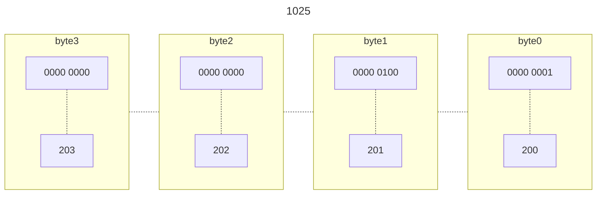
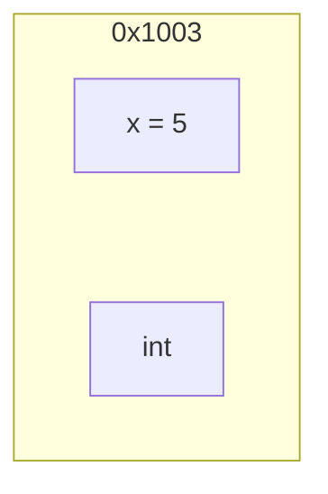
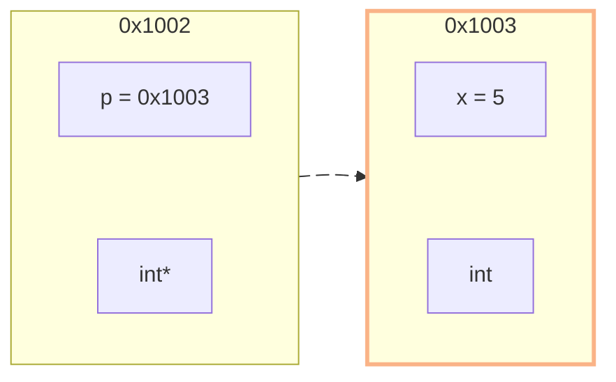
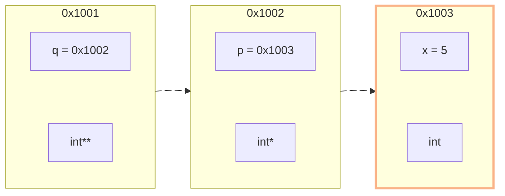
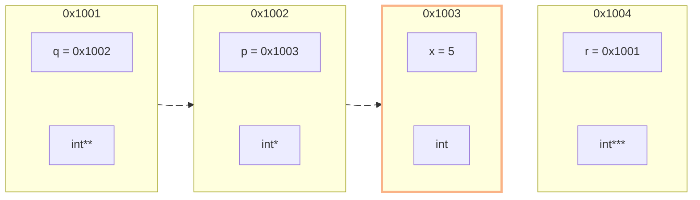
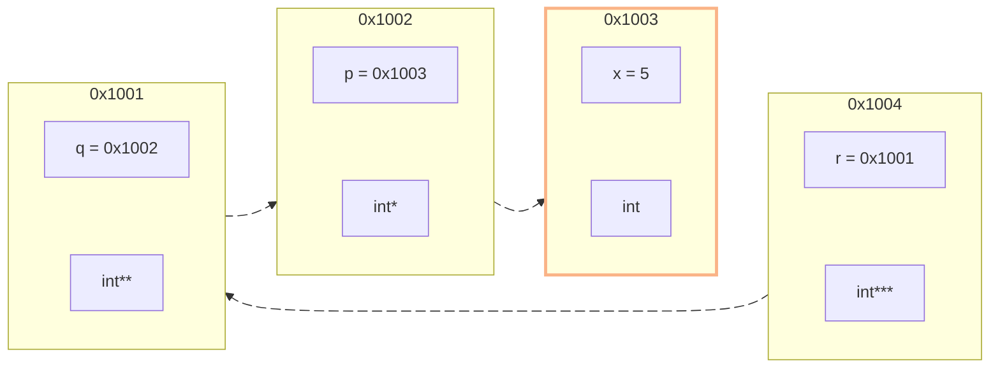

# Pointers

C Programming Workshop

<div class="absolute bottom-10">
  <span class="font-700">
    Aurka | MESL
  </span>
</div>

---
title: visual
---

<table>
  <tbody>
    <tr>
      <th>address</th>
      <th>value</th>
    </tr>
    <tr>
      <td>0x 1000</td>
      <td>0b 0100'0001 => 'A' </td>
    </tr>
    <tr>
      <td>0x 1001</td>
      <td>0b 0100'0002 => 'B'</td>
    </tr>
    <tr>
      <td>0x 1002</td>
    </tr>
    <tr>
      <td>0x 1003</td>
    </tr>
    <tr>
      <td>0x 1004</td>
      <td>
        <v-switch>
          <template #1>0x1000</template>
        </v-switch>
      </td>
    </tr>
  </tbody>
</table>

<!-- 
1. memory kivabe thake
2. named location = variable
3. char holding places
4. digit seperator is single quote
5. we use the value. but what if we use the address
6. click
7. point aka aki je look this is the address pointing to 
-->

---
title: working basic
---

# accessing address

```c {monaco-run}
#include <stdio.h>
int main() {
    char a = 'A';
    char b = 'B';
    printf("%x\n", &a);
    printf("%x\n", &b);
}
```
<!-- 
1. getting memory address
2. we used it before? scanf
3. store it to another hex var => pointer
-->

---
title: pointer syntax
---

# pointers

```c {monaco-run}
#include <stdio.h>
int main() {
    char a = 'A';
    int pa = &a;
}
```

<!-- 
problems:
1. we dont know what type of data is inside
2. is it normal integer or memory address

solution:
pointer declaration, ekta star maira deo, with jei type er value ache
declare ar assign alada kora jay

show getting value from pointer
show print statements and stuffs. 
-->

---
layout: section
---

# Types of pointers

---
title: types of pointers
---
add `*` in type declaration. 
=> Voila! you got your pointer type

- `int` type pointer: `int*`
- `char` type pointer: `char*`

# Why not generic type?
like 
```c
pointer p = &var
```
---



```c
int a = 1025;
int* p = &a;

printf(p) => 200
printf(*p) => look for 4 memory blocks
```

---

```c {monaco-run}
#include<stdio.h>
int main(){
  int a = 1025;
  int *p = &a;
  printf("size of int: %d\n", sizeof(int));
  printf("address: %p, value: %d\n", p, *p);
}
```

<!-- 
0. %p for pointer formatting
1. take another char pointer.
2. cast previous pointer as char so that we can take 1 byte
3. same address, but value will change, cz amra 1 block nisi

// 1025 => 00000000 00000000 00000100 000000001
-->

---

# pointer arithmetic

````md magic-move
```c
#include<stdio.h>
int main(){
  int a = 1025;
  int *p = &a;
  printf("size of int: %d\n", sizeof(int));
  printf("address: %p, value: %d\n", p, *p);
  // 1025 => 00000000 00000000 00000100 000000001
  char *p0;
  p0 = (char*) p;
  printf("size of int: %d\n", sizeof(char));
  printf("address: %p, value: %d\n", p0, *p0);

}
```
```c
#include<stdio.h>
int main(){
  int a = 1025;
  int *p = &a;
  printf("size of int: %d\n", sizeof(int));
  printf("address: %p, value: %d\n", p, *p);
  printf("address: %p, value: %d\n", p+1, *(p+1));
  // 1025 => 00000000 00000000 00000100 000000001
  char *p0;
  p0 = (char*) p;
  printf("size of int: %d\n", sizeof(char));
  printf("address: %p, value: %d\n", p0, *p0);
  printf("address: %p, value: %d\n", p0+1, *(p0+1));
}
```
````

---

what if we just want address!? 

# void pointers
````md magic-move
```c
#include<stdio.h>
int main(){
  int a = 1025;
  int *p = &a;

  char *p0;
  p0 = (char*) p;
}
```
```c
#include<stdio.h>
int main(){
  int a = 1025;
  int *p = &a;

  void *p0;
  p0 = (char*) p;
}
```
```c
#include<stdio.h>
int main(){
  int a = 1025;
  int *p = &a;

  void *p0;
  p0 = p;
}
```
```c
#include<stdio.h>
int main(){
  int a = 1025;
  int *p = &a;

  void *p0;
  p0 = p;
  print("%p\n", p0);
}
```
````

<br>

<v-click>

## Issues

</v-click>

<v-clicks>

- Cannot Derefence: `*p0` not allowed
- Cannot perform pointer arithmetic: `0p+1` not allowed

</v-clicks>

<!-- baki ja janar, pore janbi usage dekhle. -->

---
layout: section
---

# pointer to pointer

---
title: pointer to pointer visual
---

<v-switch>
<template #0>


</template>
<template #1>




</template>
<template #2>



</template>
<template #3>


</template>
<template #4>


</template>
</v-switch>

---
title: example pointer to pointer
---

```c {monaco-run}
#include<stdio.h>
int main(){
  int x = 5; 
  int* p = &x; // adress of x -> p
  *p = 6; // change value of address inside p to 5
  int** q = &p; // address of p -> q
  int*** r = &q; // adress of q -> r
}
```

<!-- 
1. *p.
2. *q
3. *(*q)
4. *(*r)
5. *(*(*r))

6. ***r = 10; print value of x
7. **q = *p + 2; x=?
-->


---
title: pointer as function argument
---

# pointer as function argument

- call by value
- call by reference

````md magic-move
```c
#include<stdio.h>
int increment(int a){
  a = a + 1; // 11
}
int main(){
  int a = 10;
  increment(a); // 10
  print("a = %d\n", a); // 10
}
```
```c
#include<stdio.h>
int increment(int a){
  a = a + 1; // 11
  return a;
}
int main(){
  int a = 10;
  increment(a); // 10
  print("a = %d\n", a); // 10
}
```
```c
#include<stdio.h>
int increment(int a){
  a = a + 1; // 11
  return a;
}
int main(){
  int a = 10;
  a = increment(a); // 11
  print("a = %d\n", a); // 11
}
```
```c
#include<stdio.h>
int increment(int a){
  a = a + 1; // 11
}
int main(){
  int a = 10;
  increment(a); // 10
  print("a = %d\n", a); // 10
}
```
```c
#include<stdio.h>
int increment(int a){
  a = a + 1; // 11
}
int main(){
  int a = 10;
  increment(&a); // (0x1003)
  print("a = %d\n", a); // 10
}
```
```c
#include<stdio.h>
int increment(int* a){
  *a = *a + 1; // *(0x1003) + 1
}
int main(){
  int a = 10;
  increment(&a); // (0x1003)
  print("a = %d\n", a); // 11
}
```
````

<!-- 
1. it copy the value, doent move the value.
2. if we wanted change, we have to return, 
3. and assigned the returned value
3. we can pass the pointer. if we want direct.
-->

---
title: pointers and arrays
---

---
title: array as function argument
---

---
title: character arrays and pointers
---

---
title: pointer and 2D arrays
---

---
title: pointer and multidimensional arrays
---

---
title: dynamic allocation in C
---

---
title: pointer as function return
---

---
title: function pointer and callbacks
---

---
title: memory leak in C
---
