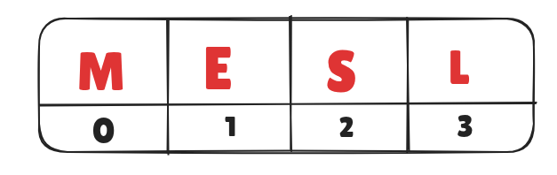

# Topic: String

**Definition**: A string is an array of characters terminated by a special character '\0' (null character).

### Example:
```
#include <stdio.h>
int main() {
    char name[] = "MESL";  // initialization
    printf("%s", name);   // output
}
```

## Indexing
String follows zero based indexing. <br>


### Modify
```
#include <stdio.h>
int main() {
  char name[] = "MESL";
  name[3] = 'S';
  printf("Output: %s",name);
}
```
## Built in functions for string
`strlen`.
```
# include <stdio.h>
# include <string.h>
int main () {
  char season[] = "winter";
  // length of string??
  printf("length= %d", strlen(season));
}
```
We have covered only one function in the class. But there are many  more, you might do a quick research on them. 

> *Cheat Note: There is a task related to this topic at the end of this doc*
## Input 
### Without Spaces
```
#include <stdio.h>
int main() {
  char name[10];
  scanf("%s",name);
  printf("%s",name);
}
```
### With Spaces
Using `fgets`. It needs three parameters. <br>
1) variable name
2) string size
3) `stdin` 
<br> 

```
#include <stdio.h>
int main() {
  char name[30];
  fgets(name, 30, stdin);
  printf("%s",name);
}
```

## Tasks

1. Determine length of string without using builtin function
2. Are the strings below equal?
```
// related to ques no. 02
#include <stdio.h>
int main() {
    char s1[10]="aabbaa";
    char s2[10]="aabaab";
}
```